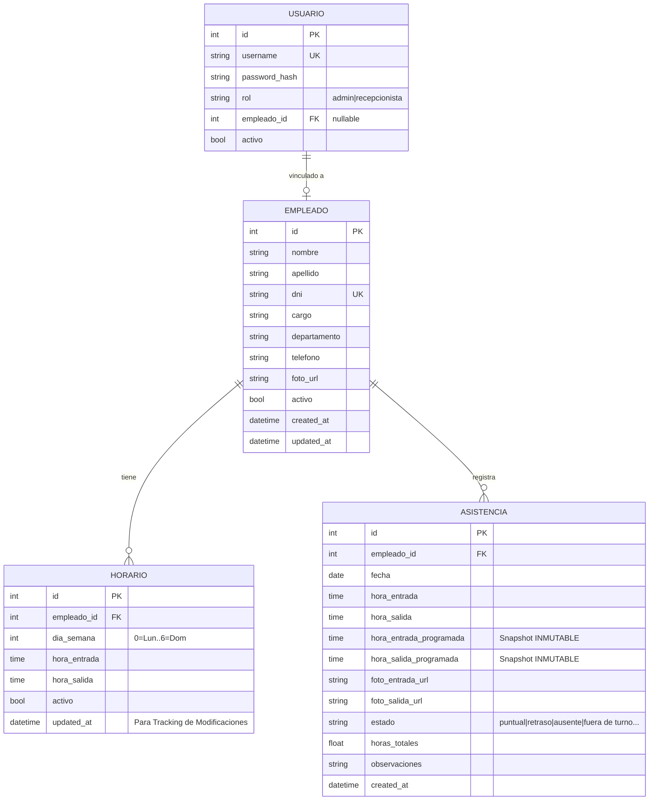

# Base de Datos

> PostgreSQL — Hospedado en Supabase (Cloud).

## Conexión

```bash
# Configurado vía variable de entorno en backend/.env
DATABASE_URL="postgresql+pg8000://..."
```

## Esquema

El esquema se gestiona mediante **SQLAlchemy** y **Flask-Migrate**.

## Diagrama ER



## Patrones de Datos

### Snapshots de Horario
Para asegurar la integridad histórica, las reglas de turnos se capturan en la tabla `ASISTENCIA` (`hora_entrada_programada` y `hora_salida_programada`) en el momento que ocurre el evento (Kiosko) o se evalúan ausencias pasadas. 
Esto evita "phantom absences" y corrupción de datos cuando los horarios de un empleado cambian retrospectivamente.

## Migraciones

_Herramienta de migraciones por definir (Flask-Migrate / Alembic)._

## Backup

SQLite permite backup simplemente copiando el archivo `.db`.
