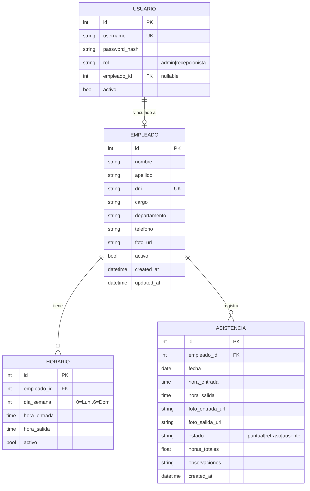

# Base de Datos

> SQLite — archivo único, zero-config.

## Ubicación

```
backend/instance/gym.db
```

## Esquema

_Por definir al implementar los módulos [[Empleados]] y [[Asistencia]]._

## Diagrama ER



## Migraciones

_Herramienta de migraciones por definir (Flask-Migrate / Alembic)._

## Backup

SQLite permite backup simplemente copiando el archivo `.db`.
